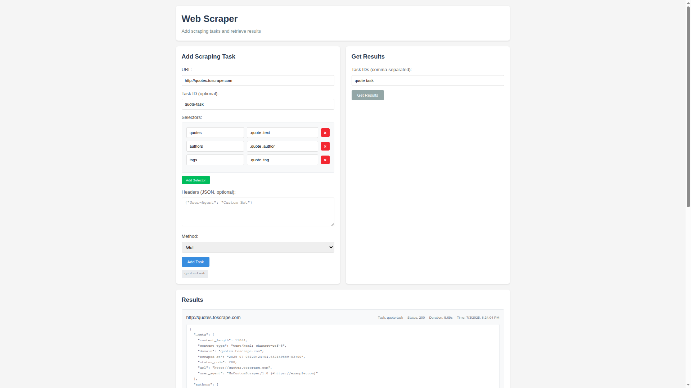
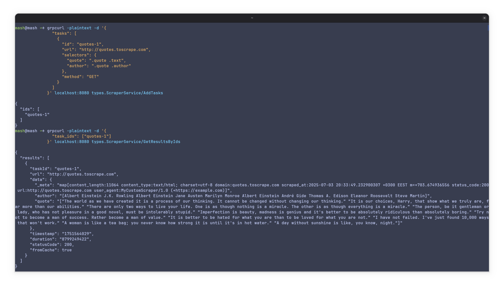
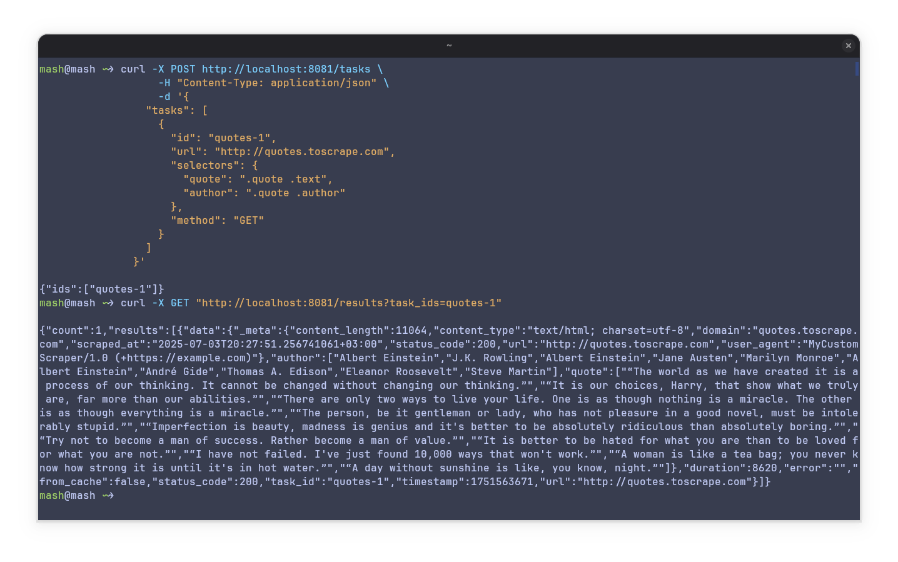
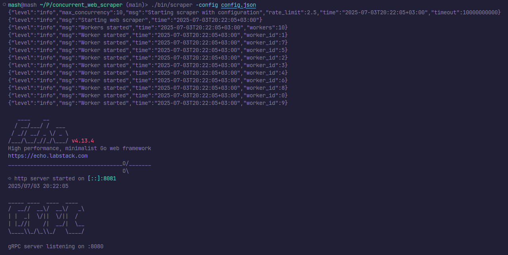

# 🕷️ Concurrent Web Scraper Microservice

A high-performance, configurable microservice for concurrent web scraping. It exposes three interfaces:

* 🌐 A **user-friendly web page** for viewing and submitting scraping tasks
* 📡 A **gRPC API** for fast, typed interactions
* 📥 A **RESTful HTTP API** via Echo server for browser/client-side access

---

## 🚀 Features

* ⚙️ **Concurrent Scraping** with configurable concurrency, timeouts, and retries
* 📊 **Statistics & Metrics** tracking processed, successful, and failed tasks
* 📦 **In-memory Caching** to reduce redundant scraping
* 🔗 **Multiple Selectors per Task** for fine-grained extraction
* 🧪 **gRPC & REST APIs** for integration and control
* 🖥️ **Interactive Web Interface** for task submission and result viewing

---

## 📸 Screenshots

### 🖥️ Web Interface



---

### 📡 gRPC Testing (e.g., with `grpcurl` or Postman)



---

### 🌐 Echo Server – REST API in Browser



---

### 🧰 CLI Output



---

## 🧱 Project Structure

```
.
├── Dockerfile
├── Makefile
├── README.MD
├── bin
│   └── scraper
├── cmd
│   └── scraper
│       └── main.go
├── config.json
├── go.mod
├── go.sum
├── internal
│   ├── cache
│   │   └── cache.go
│   ├── config
│   │   └── config.go
│   ├── ratelimit
│   │   └── ratelimit.go
│   ├── scraper
│   │   └── scraper.go
│   └── server
│       ├── grpc.go
│       └── http.go
├── pkg
│   └── types
│       ├── proto
│       └── types.go
├── screenshots
│   ├── cli.png
│   ├── echo.png
│   ├── grpc.png
│   └── web.png
├── test
│   ├── echo_server_test.go
│   ├── grpc_server_test.go
│   └── scraper_test.go
└── web
    └── index.html

```

---

## ⚙️ Installation & Usage

### 🔨 Build the project

```bash
make build
```

### ✅ Run tests

```bash
make test
```

### 🐳 Build & Run in Docker

```bash
make docker-build
make docker-run
```

* gRPC API available at `localhost:8080`
* REST API (Echo server) at `localhost:8081`

---

## 🧪 API Endpoints

### gRPC

* **Service**: `ScraperService`
* **Methods**:

  * `AddTask(ScrapingTask)`
  * `GetResults(Empty)`

> Define your gRPC client using `pkg/types/proto/scraper.proto`

### REST (Echo)

* `POST /tasks` – Add new scraping task
* `GET /results` – Get completed results

---

## 📄 Scraping Task Structure

```json
{
  "url": "http://example.com",
  "selectors": {
    "title": "h1",
    "description": ".desc"
  },
  "headers": {
    "Authorization": "Bearer token"
  },
  "method": "GET"
}
```

---

## 📦 Configuration

Supports JSON config via `-config` flag:

```json
{
  "max_concurrency": 10,
  "rate_limit": 2.5,
  "timeout": "5s",
  "retry_attempts": 3,
  "retry_delay": "1s",
  "cache_ttl": "30m",
  "user_agent": "MyScraperBot/1.0",
  "max_body_size": 1048576
}
```

Or use built-in defaults.

---

## 📜 Makefile Targets

| Target              | Description                             |
| ------------------- | --------------------------------------- |
| `make all`          | Clean, format, test, build              |
| `make build`        | Build the binary in `bin/scraper`       |
| `make test`         | Run all tests                           |
| `make fmt`          | Format Go code                          |
| `make clean`        | Remove binaries                         |
| `make proto`        | Generate Go code from proto definitions |
| `make docker-build` | Build Docker image                      |
| `make docker-run`   | Run container with ports exposed        |

---

## 🛠 Development

To regenerate gRPC stubs:

```bash
make proto
```

---

## 🧹 Graceful Shutdown

Handles `SIGINT` and `SIGTERM` signals, ensuring:

* Scraper stops cleanly
* Final statistics are logged
* Servers are shut down without leaks

---

## 🧑‍💻 Author & License

Created by Mohamed Abbas Homani
Licensed under the MIT License